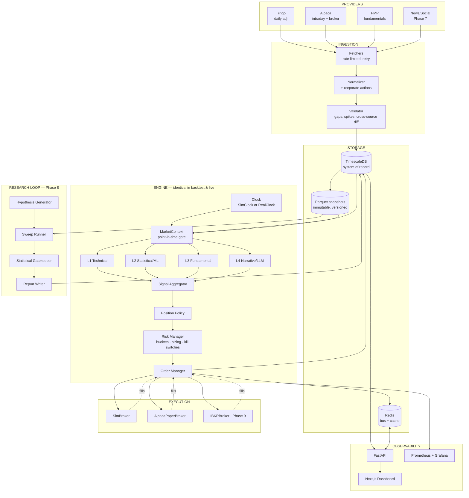

# ATLAS — System Architecture

## Overview



## 3.1 The Parity Guarantee

The only structural difference between a backtest and live trading is the **Clock** and the **Broker**:

| Component | Backtest | Paper | Live |
|---|---|---|---|
| Clock | `SimClock` (iterates historical bars) | `RealClock` | `RealClock` |
| Broker | `SimBroker` (cost model) | `AlpacaPaperBroker` | `IBKRBroker` |
| Signals · Aggregator · Policy · Risk · OMS | **identical objects** | **identical** | **identical** |

`MarketContext` is the **only** way any signal may read data. It hard-filters on `timestamp <= clock.now`. Attempting to access future data raises `LookaheadError`.

## 3.2 Repository Layout

```
atlas/
├── AGENTS.md
├── CLAUDE.md                        # -> "Read and follow AGENTS.md."
├── README.md
├── Makefile
├── compose.yml  compose.dev.yml  compose.live.yml
├── pyproject.toml  uv.lock  .env.example
├── docs/
│   ├── MASTER_PLAN.md
│   ├── ARCHITECTURE.md
│   ├── DATA_CONTRACTS.md
│   ├── STRATEGY_SPEC.md
│   ├── RISK_FRAMEWORK.md
│   ├── VALIDATION_PROTOCOL.md
│   ├── ROADMAP.md
│   ├── RUNBOOK.md                   # ops: restart, recover, kill switch reset
│   ├── working_notes.md
│   └── decisions/ADR-0001-*.md
├── atlas/
│   ├── core/        clock.py context.py types.py money.py config.py logging.py bus.py errors.py calendar.py
│   ├── data/        providers/{tiingo,alpaca,yfinance,fmp}.py ingest.py normalize.py validate.py snapshots.py universe.py
│   ├── signals/     base.py aggregator.py l1_technical/ l2_statistical/ l3_fundamental/ l4_narrative/
│   ├── strategies/  base.py registry.py policies/ definitions/
│   ├── portfolio/   buckets.py positions.py accounting.py ledger.py
│   ├── risk/        manager.py sizing.py limits.py killswitch.py
│   ├── execution/   broker.py oms.py sim_broker.py alpaca_broker.py ibkr_broker.py costs.py
│   ├── backtest/    engine.py runner.py metrics.py walkforward.py montecarlo.py attribution.py
│   ├── research/    hypotheses.py sweep.py gatekeeper.py reports.py trials.py
│   ├── runner/      live.py scheduler.py health.py
│   └── api/         main.py routers/ schemas/ ws.py
├── strategies/                      # YAML specs — the versioned artifacts
├── web/
├── migrations/
├── tests/           unit/ integration/ property/ fixtures/
├── notebooks/                       # never imported by atlas/
└── data/            raw/ snapshots/ artifacts/     # gitignored
```

## Web Dashboard Specification

Read-mostly. Single-user session cookie (Phase 4), TOTP 2FA before live (Phase 9).

| Page | Content |
|---|---|
| **Overview** | Total equity curve, today's P&L, per-bucket allocation donut, open positions, active kill switches, data health, next rebalance |
| **Versions** | Strategy versions table, compare view, overlaid equity curves, drawdown plot, metrics diff, lineage tree |
| **Run Detail** | Metrics panel, trade list, entry/exit markers, signal values, layer attribution, parameter heatmap, reproducibility footer |
| **Live / Paper** | WebSocket streaming: order blotter, fill log, position table, per-bucket P&L, engine heartbeat, reject stats |
| **Research** | Trial queue, hypothesis backlog, candidate reports, trial budget counter |
| **Data Health** | Coverage matrix, gap list, cross-source discrepancies, snapshot list |
| **Signals Explorer** | Price + signal layer score sub-panels |
| **Ops** | Log stream, kill-switch reset buttons, scheduler status, manual emergency actions |

## 3.3 Theme & Color System

ATLAS uses a consistent, high-contrast dark "developer/terminal" aesthetic tailored for high-density quantitative trading data.

### Design Tokens

```css
:root {
  /* Surfaces (Layered near-black; each tier a few % lighter) */
  --bg: #0a0a0a;             /* App background (near black) */
  --bg-sidebar: #0d0d0d;     /* Navigation / sidebar container */
  --surface: #141414;        /* Primary cards, panels, and modals */
  --surface-2: #1c1c1c;      /* Hover states, secondary buttons, dropdowns */
  --active: #1a1a1a;         /* Selected row, active navigation item */

  /* Borders (Hairline, low contrast) */
  --border: #262626;         /* Card edges, table dividers, panel borders */
  --border-subtle: #1f1f1f;  /* Faint sub-section separators */

  /* Text (Three tiers of typographic hierarchy) */
  --text-1: #ededed;         /* Primary figures, headings, key values */
  --text-2: #a1a1aa;         /* Secondary data, timestamps, table cells */
  --text-3: #71717a;         /* Labels, placeholders, empty states */

  /* Trading-Semantic Colors */
  --pos: #22c55e;            /* Positive / profit / buy / long / gain (Global Accent) */
  --neg: #ef4444;            /* Negative / loss / sell / short (Errors/Losses only) */
  --warn: #f59e0b;           /* Warning / pending / queued / neutral alerts */
  --info: #38bdf8;           /* Informational / neutral highlights (sparingly) */
}
```

### Trading Semantic & Usage Rules
1. **Green (`--pos`: `#22c55e`)** is the primary brand accent and status pop. Used for "alive/ready" status dots, positive P&L deltas, buy/long markers, and equity curve gains.
2. **Red (`--neg`: `#ef4444`)** is strictly reserved for losses, sell/short signals, and critical errors. Rendered exclusively as small badges, dots, or text values—never as large filled surfaces.
3. **Amber (`--warn`: `#f59e0b`)** and **Sky Blue (`--info`: `#38bdf8`)** are restricted to small tags, badges, and status chips. Do not paint buttons or large panels with these colors; the UI remains neutral dark + green accent.
4. **Signal Exclusivity:** Red and green must never be used for non-directional/non-financial UI elements.
5. **Geometry & Hierarchy:** Radii are kept compact (~6–8px) for buttons, inputs, and cards. Labels use uppercase styling with `~0.05em` letter-spacing. All text maintains high contrast on surface layers.
